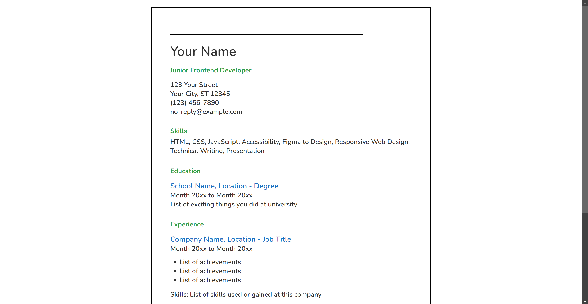

# Single Page CV

## Description

Single Page CV is a simple, elegant, and responsive HTML/CSS template designed for creating a personal CV or resume. This project focuses on showcasing your skills, education, experience, and online presence in a single-page layout. It is ideal for frontend developers, designers, or anyone looking to create a stylish and professional resume without needing complex tools.

You can get more information about this project on the [roadmap.sh page](https://roadmap.sh/projects/single-page-cv).

## Features

- **Responsive Design:** Adapts to various screen sizes and devices.
- **Clean Layout:** Structured sections for skills, education, experience, and online profiles.
- **SEO Optimized:** Basic meta tags included for better search engine visibility.
- **Customizable:** Easy to edit and update with your personal information.

## Screenshot



## Installation

To get started with the Single Page CV project:

1. **Clone the Repository:**
   ```bash
   git clone https://gitlab.com/Yashi-Singh-9/single-page-cv.git
   ```
2. **Navigate to the Project Directory:**
   ```bash
   cd single-page-cv
   ```
3. **Open the `index.html` File:**
   - You can view the CV by opening `index.html` in any web browser.

## Usage

Customize the `index.html` file to include your personal information:

- Replace "Your Name" with your actual name.
- Update the contact information, including address and email.
- Modify the skills, education, and experience sections to reflect your background.
- Add your LinkedIn and GitHub profile links in the "Across the Internet" section.

Here’s a quick example of how to modify the skills section:

```html
<div class="cv-skills">
    <h3 class="section-title">Skills</h3>
    <p class="skill-list">HTML, CSS, JavaScript, React, Node.js, Git</p>
</div>
```

## Support

For any issues or questions, please open an issue on the [GitLab repository](https://gitlab.com/Yashi-Singh-9/single-page-cv/issues) or contact me on [LinkedIn](https://www.linkedin.com/in/yashi-singh-b4143a246).

## Contributing

Contributions are welcome! If you'd like to improve this template or suggest new features:

1. Fork the repository.
2. Create a new branch (`git checkout -b feature-branch`).
3. Make your changes and commit (`git commit -am 'Add new feature'`).
4. Push to the branch (`git push origin feature-branch`).
5. Open a Merge Request.

Please ensure your changes adhere to the project's coding standards and include relevant documentation if necessary.

## Authors and Acknowledgment

- **Yashi Singh** - Initial work and development.
- Thanks to the community and resources at [roadmap.sh](https://roadmap.sh) for inspiration.

## License

This project is licensed under the MIT License - see the [LICENSE](LICENSE) file for details.

## Project Status

This project is actively maintained. However, if you notice any issues or have suggestions for improvements, feel free to contribute or raise an issue.
